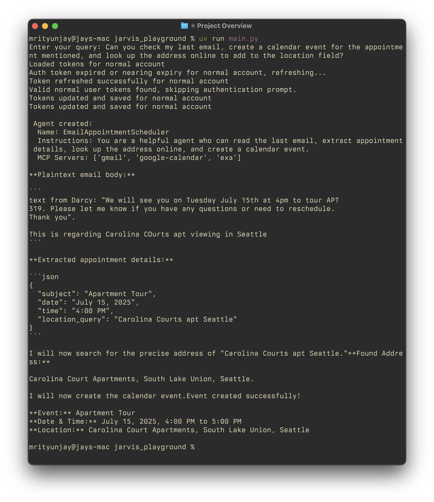

# Jarvis

An intelligent AI agent orchestration system that dynamically creates specialized agents to accomplish complex tasks. The system uses a planner agent to analyze user queries and automatically configure agents with appropriate MCP (Model Context Protocol) servers and instructions.

## Overview

Jarvis combines intelligent planning with modular tool access through MCP servers. When you provide a natural language query, the system:

1. **Analyzes Intent**: A planner agent powered by Gemini understands your goals and requirements
2. **Designs Agent**: Creates a specialized agent specification with relevant capabilities and instructions
3. **Configures Tools**: Automatically selects and connects appropriate MCP servers
4. **Executes Tasks**: Runs the configured agent to accomplish your objectives

This architecture enables dynamic agent creation for diverse tasks like calendar management, web research, file operations, team communication, and more.

## Demo



*Jarvis in action: Intelligent agent creation and multi-step task execution with agents built dynamically*

## Features

- **Intelligent Planning**: Automatic agent configuration based on natural language queries
- **Dynamic Agent Creation**: Specialized agents tailored to specific task requirements
- **MCP Server Integration**: Support for multiple MCP server types (stdio, SSE, HTTP)
- **Streaming Output**: Real-time response streaming for better user experience
- **Extensible Architecture**: Easy addition of new MCP servers and capabilities

## Installation

### Prerequisites

- Python 3.11 or higher
- Node.js (for MCP servers)
- API keys for Gemini and OpenAI

### Setup

1. **Clone the repository**
   ```bash
   git clone https://github.com/mewtyunjay/jarvis.git
   cd jarvis
   ```

2. **Install dependencies**
You can install the dependencies with either pip or uv:

With pip:
   ```bash
   pip install -e .
   ```

With uv:
```bash
uv pip install -e .
```

3. **Configure environment variables**
   
   Create a `.env` file in the project root:
   ```env
   GOOGLE_API_KEY=your_gemini_api_key_here
   OPENAI_API_KEY=your_openai_api_key_here
   ```

   Both API keys are required:
   - **GOOGLE_API_KEY**: Used by the planner agent for intent analysis and agent specification generation
   - **OPENAI_API_KEY**: Used by the OpenAI agents framework for task execution

## MCP Server Configuration

1. **Create MCP configuration file**
   ```bash
   cp mcp/mcp_config.example.json mcp/mcp_config.json
   ```

2. **Configure MCP servers**
   
   Edit `mcp/mcp_config.json` to include the servers you want to use. The configuration supports three server types:

   **Stdio servers** (run local processes):
   ```json
   "filesystem": {
     "type": "stdio",
     "command": "npx",
     "args": ["-y", "@modelcontextprotocol/server-filesystem", "."],
     "cache_tools_list": true,
     "client_session_timeout_seconds": 30
   }
   ```

   **SSE servers** (server-sent events):
   ```json
   "custom-sse-server": {
     "type": "sse",
     "url": "http://localhost:3001/sse",
     "headers": {"Authorization": "Bearer YOUR_TOKEN"},
     "timeout": 30.0,
     "sse_read_timeout": 600.0
   }
   ```

   **HTTP servers** (streamable HTTP):
   ```json
   "exa-remote": {
     "type": "streamable_http",
     "url": "https://mcp.exa.ai/mcp?exaApiKey=YOUR_API_KEY",
     "headers": {"Content-Type": "application/json"},
     "timeout": 30.0
   }
   ```

3. **Add API keys for external services**
   
   Update the configuration with your API keys for services like:
   - Brave Search API
   - GitHub Personal Access Token
   - Slack Bot Token
   - Exa API Key

## Usage

### Basic Usage

Run the main application:
```bash
python main.py
```

Using uv with:
```bash
uv run main.py
```

Enter your query when prompted. Examples:
- "Check my calendar and send a summary to my team on Slack"
- "Research the latest AI developments and create a report"
- "Analyze my GitHub repositories and suggest improvements"

### Advanced Usage

The system automatically:
- Selects appropriate MCP servers based on your query
- Creates specialized agent instructions
- Configures the agent with necessary tools
- Executes tasks with streaming output

### Example Workflow

```
Enter your query: Schedule a meeting and research the agenda topics

Agent created:
  Name: Meeting Scheduler & Research Agent
  Instructions: You are a helpful agent who schedules meetings and researches agenda topics
  MCP Servers: ['filesystem', 'brave-search', 'github']

[Streaming output of agent execution...]
```

## Important Notice

**Human-in-the-loop validation is not currently implemented. Execute with caution, especially for operations that:**
- Modify files or systems
- Send communications
- Access external services
- Perform irreversible actions


## Architecture

The system uses:
- **Gemini API**: For intelligent planning and agent specification
- **OpenAI Agents**: For task execution and tool usage
- **MCP Protocol**: For standardized tool integration
- **Async Architecture**: For efficient concurrent operations

## Troubleshooting

**Common Issues:**
- **API Key Errors**: Ensure both GOOGLE_API_KEY and OPENAI_API_KEY are set
- **MCP Server Failures**: Check server configurations and network connectivity  
- **Permission Errors**: Verify file system permissions for MCP servers
- **Timeout Issues**: Adjust timeout values in MCP configuration